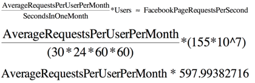
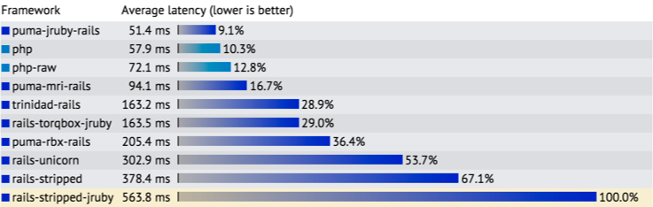
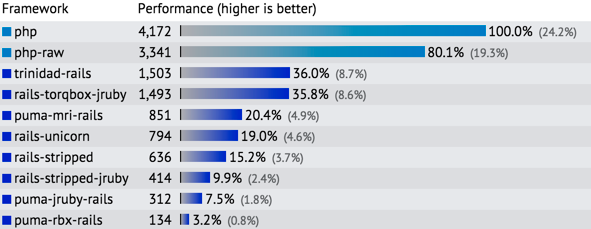
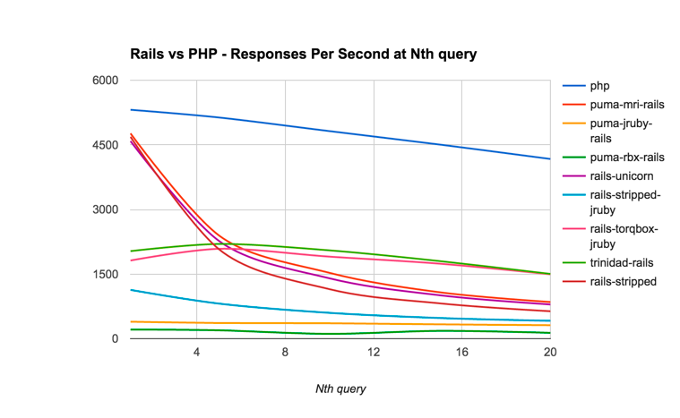

PHP & Ruby on Rails: Web Frameworks
=============

**Introduction**

Web frameworks have been around since the 1990’s, but few people could tell you what they do. Web frameworks are massive software projects written to facilitate the handling of internet requests. When a browser goes to websites, a server online responds with HTML, which your browser has been built to display in a pleasing format. This paper first examines the responsibilities of a web framework by explaining the difficulties it must overcome. Second, it describes three important web frameworks that have greatly influenced web development, PHP, Ruby On Rails, and Meteor. Finally, it statistically compares the PHP and Rails web frameworks in very basic scenarios.
Since the 90’s, the responsibilities and duties of web frameworks have been greatly increased. People have become dependent on the internet for email, shopping, notifications, the news, and just about everything. In the early 90’s the internet was in the “Web 1.0” era. Most web pages were static, and most users couldn’t add content to the internet without building their own web page [(1)] [1]. Advertising to consumers on the web was like building an ad poster; content was mostly consumed [(2)] [2].

As computing power on the backend increased and internet usage became more socially acceptable, websites started to allow users to add and dynamically generate content. These abilities have been colloquially referred to as ‘Web 2.0’. Facebook, Amazon, and Google have grown to dominate this era. Web 2.0 has also been marked by “customer targeting and personalization” [(2)] [2]. If you frequently use Amazon, you will receive suggestions based on other products you have looked at or purchased. PHP: Hypertext Processor (PHP), one of the first web frameworks to appear, allowed programmers to build websites with Web 2.0 features.

**HTTP Protocol**

Dynamic web pages are very difficult to build for a few reasons. Unlike applications on computers (Microsoft Word, Adobe Reader, etc.), websites you visit on the web **cannot contain state**. State is "the data that defines the condition of some object or system". The Hypertext Transfer Protocol (HTTP) that allows browsers to visit websites online was purposefully designed as a stateless protocol [(7)] [7]. A stateless protocol is a communications protocol that treats each request as an independent message. Many websites today use cookies (session data) and complicated javascript frameworks to create a sense of state, but it is important to recognize that a lack of state is an inherent difficulty associated with web development over the HTTP [(9)] [9]. The HTTP 1.1 describes nine request methods, however, only a few are necessary for understanding the basic functions of a web server.

Whenever you pass information from your browser to a web server your browser makes a POST or a PUT HTTP request. Typically these requests happen when a web patron logs into a website, selects merchandise, or submits data. Similarly, a request called GET pulls information from a server to your browser. The majority of the GET requests are for static pieces of data; the static data can be requests from a Content Delivery Network (CDN). This results in the web server almost exclusively handling features introduced in the Web 2.0 era. In fact, websites that are entirely static do not need a formal web server and can be hosted using a CDN. GET requests are made for each image, icon, javascript library, and css styling sheet, among other types of data [(10)] [10].

For example, directing a browser to [Google] [google] results in over fifty GET requests and single POST [Measured using Google Chrome Developer Tools]. Going to [Facebook] [facebook], in a logged in account, yielded over three hundred individual GET requests. These numbers are inherently approximate in nature. It’s also important to note that PUT and GET requests must be idempotent, computer science jargon for “an action that, if repeated, results in no change” [(8)] [8]. For example, if you click a google link multiple times, you should receive the same information from the server.

Another difficulty web frameworks face is the number of requests they must simultaneously process. All modern web frameworks have support for concurrently handling HTTP requests, but it’s difficult without numbers to judge how many requests a web framework must handle. Examining the requests to an existing application can give insights into the demands of a web framework. Facebook uses PHP, one of the frameworks this paper is analyzing, so it is a natural choice for this analysis. It’s worth mentioning that Facebook is the second most visited site on the internet; this analysis seeks the worst possible conditions.

Knowing how many page requests Facebook receives will help identify what should be expected of a web framework. Statista, a statistics aggregator, noted that “As of the third quarter of 2015, Facebook had 1.55 billion monthly active users”, or, about 20 percent of all people on earth (7.4 billion people) [(3)] [3],[(4)] [4]. The equations below describe the number of page requests Facebook receives per second:

These equations, although approximate, demonstrate that Facebook is receiving on average at least 600 requests per second. This equation is highly dependent on the average number of requests per user per month - a quantity that must be greater than one because we are using active users. However, this is only an estimate of the initial GET request.
Content that dynamically updates in your browser, such as a stock market ticker or a twitter feed, uses javascript to make GET requests to the server for more information.

**Dynamic HTTP Requests**

Around the same time that Ruby on Rails (Rails) was being built, a method for this dynamic transaction was introduced. To put it simply, Javascript had a method called ‘XMLHttpRequest’ to make an asynchronous HTTP requests to a server. Kayak, often credited as the first website to use ‘XMLHttpRequest’, said in 2006 “A key part of being fast was doing the xml http thing, so user refinements would not cause annoying page reloads.” [(11)] [11]

Javascript Ajax, a library that allows for asynchronous communication with a server from a client browser, is the most used and largest proponent of dynamically loading web pages [(5)] [5]. Ajax is powered by the ‘XMLHttpRequest’ method. Ajax was created in 2005 to remove the low level process of calling the ‘XMLHttpRequest’ method, allowing the programmer to more quickly write code that only dealt with the presentation and formal request of the data. Many popular websites today use Ajax to provide users with quick feedback, notifications, and uploading data.

There are primarily two ways to in which Ajax is used: for sending information to the server, such as a message you are sending to a friend in facebook, and polling for new information. It is important to note that using this type of dynamic updating requires the browser to constantly ask the server if new information has come in. This is called long polling. For example, Gmail.com may use Ajax in the browser to ask the Gmail server if you recieved a new email. Typically the type of polling occurs in regular intervals. Polling like this allows for fast updates, however, it can be computationally burdensome for both the client browser and the server. Thankfully another technology exists to deal with this.

Websockets offer a different approach to dynamic updates. This bi-directional line of communication allows for the server to push notifications directly to the browser. Facebook updates, twitter feeds, and other features on websites use websockets to efficiently notify patrons [(6)] [6]. Modern web frameworks, such as Meteor, have been built to exclusively take advantage of websockets. Rails has planned for its 5th edition to natively support websockets with it’s own library called ActionCable. PHP supports websockets through different libraries. Although websockets have the majority of the features of Ajax, it most likely will not be a complete replacement for Ajax for many years due to a lack of support by browsers [13] [14].

One other aspect of web frameworks that has not been introduced is how the web server stores all of the data about its users. Storing user data efficiently is now a solved problem, but it is still a difficulty web frameworks have to overcome. Databases, such as MySQL, Postgresql, and MongoDB, are written solely for the purpose of quickly reading and writing data to storage files. Web Frameworks have adapters that allow them to connect to the database and update information when a POST request is given, or retrieve data to send back when given a GET request. Meteor originally exclusively supported MongoDB, but now it also supports Postgresql. Many web frameworks, such as Rails, have abstracted the layer of communication with the database; database-agnostic web frameworks allow programmers to flip between databases without rewriting a lot of the code that interfaces with the database.

There are other aspects of web frameworks, such as testing, caching, routing requests, and security that this paper will not examine since they require more background knowledge to cover. They are also not essential to understanding the basic demands of a web framework. With the knowledge that: HTTP is a stateless communication protocol, web frameworks have to be designed to concurrently handle many requests per second, technologies exist for dynamic asynchronous communication with the server, and that databases are essential to any scalable website, web frameworks can now be properly compared and examined.

**Web Frameworks**

A web framework routes HTTP requests to actions based on sessions data and data it receives from a database. In the Web 2.0 era and beyond, web servers have grown to support dynamic HTTP requests from technologies such as Ajax and websockets. Since the Web 1.0 era, Static content has been offloaded to CDN’s, Database support has been built into the frameworks, and dynamic updates with javascript have become consumer requirements. As discussed earlier, web frameworks have to overcome a lot of difficulties in order to meet the demands of Web 2.0 era.

PHP was originally named Personal Home Page [(15)] [15]. Created in the mid to late 90’s, PHP was developed when much of the web was static web pages. Ajax and websockets were around, but no one implemented them. PHP was originally written to create a dynamic personal home page. Today it powers websites such as Facebook, Wikipedia, Flickr, and WordPress.com, among others [(17)] [17]. PHP is an easy language to learn because of it’s simple syntax. [BuiltWith.com] [builtwith] lists PHP with 40% of the current web framework market share, exceeding every other web framework [(18)] [18]. Much of PHP’s market share comes from tools, such as wordpress, that allow anyone to build a PHP website with minimal programming skills.

Rails was developed to alleviate some of the development problems associated with Web Frameworks. Rails introduced the principles of “Convention over Configuration” (CoC) and “Don’t Repeat Yourself” (DRY) to make rapid web development possible [(19)] [19]. CoC means developers rely on standard conventions instead of rewriting boilerplate code every time they need to build a new feature. Once a developer is acquainted with these conventions, he or she can quickly develop features with clear standards, hence the name ‘Rails’. DRY means developers should attempt to duplicate as little code as possible - features in Rails, such as Concerns, Gems, and ERB templates encourage this principle. According to [BuiltWith.com] [builtwith], Rails has about 1% of the current web framework market share.

Meteor is a brand new framework developed solely using Javascript. It was developed to reduce the number of languages a developer has to write in in order to build a website. All modern websites built today have to incorporate some javascript; typically a developer has to write in both javascript and the language his web framework uses (and also html, css, yaml, xml and others) to build a fully functioning website. Meteor was also developed to almost exclusively use websockets. This has allowed for new Meteor websites to function similar to Google Docs. Meteor first attempts to set up websockets with the server, but if it fails, it will fall back to using long polling methods similar to Ajax. Meteor has almost no market share, but that’s expected with a web framework that is still being developed - PHP and Rails went through the same phase.

Unfortunately Meteor is very new, so it is difficult to directly contrast to the more established Rails and PHP. Meteor just recently hit 1.0, compared to Rails heading into 5.0, and PHP recently upgrading to it’s 7th edition.

It’s difficult to directly contrast web frameworks without resorting to opinions. The number of variables involved in a single web server implementation is staggering: database, implementation of your framework (Rails has 10 different but similar implementations in the analysis that follows), framework version, libraries & their corresponding versions, and the server running the framework, among many many other variables.

If there is anything this paper has stressed, it has been the growth of technologies surrounding and the many complexities involved with web development. When choosing a web framework, **performance is typically the last thing one ought to consider**. Changing frameworks is nearly impossible, but changing databases or how your API works can be simpler in one framework than another. Granted, if a project involves dealing with time critical data, web frameworks are most likely not even going to be considered. But if you were interested in choosing the fastest framework, the statistical analysis that follows should help you decide between Rails and PHP.

**Rails and PHP statistical comparison**

The First Null Hypothesis is that there is a statistically significant difference in latency between PHP and Rails, when being tested with 20 queries. Our hypothesis is looking for a difference between the frameworks themselves, not the specific implementations of the frameworks. Data is from [Techempower.com] [21]. All data was collected using MySQL as the database and Linux as the operating system.

Even though we are given the standard deviation data, the T-distribution will be used to determine if there is a difference in latency. It was chosen because the sample sizes are quite small.

| Framework |   Mean   | SD      | N |
|-----------|:--------:|---------|---|
| Rails     | 240.3375 | 168.082 | 8 |
| PHP       | 65       | 10.040  | 2 |

With t = 1.4103, and df = 8, the p-value was 0.1961. This p-value is too large to show a statistically significant result. Therefore the First Null Hypothesis must be Rejected. The difference in latency between Rails and PHP is not statistically significant.
The Second Null Hypothesis is that there is a statistically significant difference in Responses Per Second (RPS) between PHP and Rails, when being tested with twenty queries. The data from Techempower.com shows this as ‘Performance’, but it represents the number of requests the server can respond to in a second. The 20 requests being made are GET requests.

| Framework |   Mean  | SD          | N |
|-----------|:-------:|-------------|---|
| Rails     | 767.125 | 510.7474739 | 8 |
| PHP       | 3756.5  | 587.6057352 | 2 |

With t = 7.25, and df = 8, the p-value was 0.000044. Because the p-value < 0.5, this means that the difference between PHP and Rails in Requests Per Second is statistically significant; this appeared to be the case in the chart above, but the two-tailed t test proved it was statistically significant. The Second Null Hypothesis must be Accepted. Therefore there is a statistically significant difference in the RPS between Rails and PHP.

Below is a chart of the responses per second at the Nth query. It’s fairly clear that the PHP implementation performs better than the Rails implementations. In fact, the better performing PHP implementation was off the charts - the other implementations could not be seen.

Modern web frameworks are very complicated. As this project has hopefully shown, it is very difficult to compare web frameworks. The sheer number of responsibilities and tasks a single framework must be able to perform is staggering. However, it is now statistically proven (under these very specific conditions) that PHP has an edge over Rails when it comes to RPS.

[facebook]:  https://www.facebook.com
[google]:    https://www.google.com
[builtwith]: http://trends.builtwith.com/framework

[1]:  http://firstmonday.org/ojs/index.php/fm/article/view/2125/1972
[2]:  http://smallbiztrends.com/2015/11/e-commerce-to-web-3-0-book-review.html
[3]:  http://www.statista.com/statistics/264810/number-of-monthly-active-facebook-users-worldwide/
[4]:  http://www.worldometers.info/world-population/
[5]:  http://www.wrox.com/WileyCDA/Section/id-303217.html
[6]:  https://lostechies.com/chrismissal/2013/08/06/browser-wars-websockets-vs-ajax/
[7]:  http://tools.ietf.org/html/rfc7230
[8]:  http://stackoverflow.com/questions/1077412/what-is-an-idempotent-operation
[9]:  https://tools.ietf.org/html/rfc2616
[10]: http://www.webopedia.com/TERM/C/CDN.html
[11]: http://kayaklabs.blogspot.com/2006/04/kayak-user-interface.html
[12]: http://www.developerfusion.com/article/143158/an-introduction-to-websockets/
[13]: http://justbuildsomething.com/the-good-and-bad-of-websockets-over-ajax/
[14]: http://stackoverflow.com/questions/10377384/why-use-ajax-when-websockets-is-available
[15]: http://php.net/manual/en/history.php.php
[16]: http://guides.rubyonrails.org/active_record_basics.html
[17]: https://www.quora.com/What-are-the-top-10-websites-built-with-PHP
[18]: http://trends.builtwith.com/framework
[19]: http://guides.rubyonrails.org/getting_started.html

[techempower]: https://techempower.com
[20]:          https://www.techempower.com/benchmarks/#section=data-r11&hw=peak&test=db&f=w0-0-0-0-0
[21]:          https://www.techempower.com/benchmarks/#section=data-r11&hw=peak&test=query&f=w0-0-0-0-0
